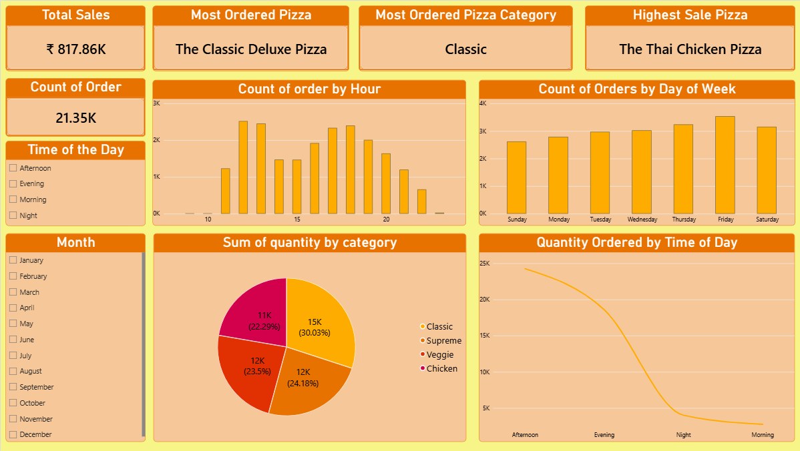

# 🍕 PowerBI Pizza Sales Dashboard

Interactive Power BI dashboard for analyzing pizza sales, orders, products, categories, and customer ordering patterns.

---

## 📌 Project Overview

This project is an interactive **Pizza Sales Dashboard** created using Microsoft Power BI.

The dashboard analyzes pizza sales and order data to identify important business insights such as:

- Total sales
- Most ordered pizza
- Highest-selling pizza
- Most ordered pizza category
- Orders by hour
- Orders by day of the week
- Pizza quantity by category
- Ordering patterns by time of day

The project was built from **data loading and transformation to data modeling, DAX calculations, and interactive visualization**.

---

## 🎯 Objectives

The main objectives of this project are:

- Analyze overall pizza sales performance
- Identify the most ordered pizza
- Identify the pizza generating the highest sales
- Identify the most ordered pizza category
- Analyze ordering patterns by hour
- Analyze orders by day of the week
- Analyze pizza quantity by category
- Identify the time of day when customers order more pizzas
- Present insights using interactive Power BI visualizations

---

## 🛠️ Tools & Technologies

- **Microsoft Power BI**
- **Power Query**
- **DAX**
- **Data Modeling**
- **Data Visualization**

---

## 📊 Dashboard Features

### 1. Sales KPI

The dashboard displays:

- Total Sales
- Total Order Count
- Most Ordered Pizza
- Most Ordered Pizza Category
- Highest Sale Pizza

---

### 2. Order Analysis

The dashboard analyzes orders using:

- Count of Orders by Hour
- Count of Orders by Day of Week
- Time of Day analysis

The hourly analysis helps identify the hours during which customers place more orders.

---

### 3. Pizza Category Analysis

The dashboard visualizes the quantity of pizzas ordered across different categories:

- Classic
- Supreme
- Veggie
- Chicken

---

### 4. Time-of-Day Analysis

Orders are analyzed across different parts of the day:

- Morning
- Afternoon
- Evening
- Night

This helps identify customer ordering patterns throughout the day.

---

### 5. Interactive Filters

The dashboard includes interactive slicers for:

- Time of Day
- Month

These filters allow users to explore the data dynamically.

---

## 🖼️ Dashboard Preview

### Main Dashboard



---

## 🧮 DAX Measures

The project uses DAX to calculate important business metrics, including:

- Total Sales
- Highest Sales Pizza
- Most Ordered Pizza
- Most Ordered Pizza Category

The complete DAX formulas are available here:

[DAX Measures](PowerBI_Pizza_Sales_Dashboard/DAX/DAX_Measures.md)

---

## 🔍 Key Business Questions

The dashboard was designed to answer questions such as:

1. What are the total pizza sales?
2. Which pizza is ordered the most?
3. Which pizza generates the highest sales?
4. Which pizza category is ordered the most?
5. At which hours are the most orders placed?
6. Which day of the week receives the most orders?
7. Which pizza category has the highest quantity ordered?
8. At what time of day do customers order more pizzas?

---

## 📈 Insights

The dashboard provides a visual way to identify:

- Customer ordering patterns
- Popular pizza products
- High-performing pizza categories
- Peak ordering hours
- Daily ordering trends
- Time-of-day ordering behavior

---

## 📁 Repository Structure

```text
PowerBI_Pizza_Sales_Dashboard/
│
├── README.md
│
└── PowerBI_Pizza_Sales_Dashboard/
    │
    ├── DAX/
    │   └── DAX_Measures.md
    │
    ├── Dashboard/
    │   └── Pizza_Sales_Dashboard.pbix
    │
    └── Screenshots/
        ├── dashboard.png
   
---

## 💡Skills Demonstrated

Through this project, I practiced and demonstrated:

Data Loading
Data Cleaning
Data Transformation
Data Modeling
DAX
Power Query
Data Visualization
KPI Development
Interactive Dashboard Design
Business Intelligence
Data Analysis
Analytical Thinking

---

## 🚀Project Outcome

This project demonstrates how Microsoft Power BI can be used to transform raw pizza sales data into an interactive dashboard and derive meaningful insights about sales performance and customer ordering behavior.
